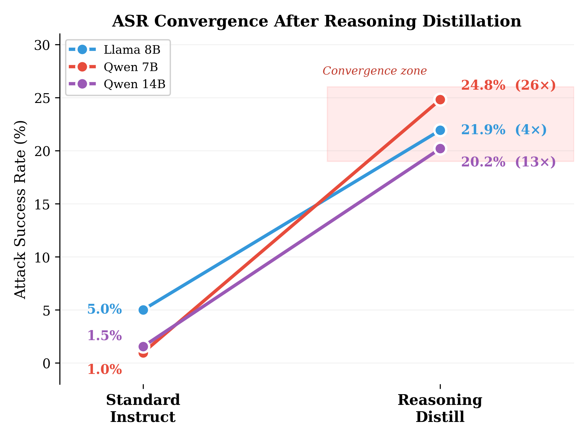

# LLM Safety Research

> Two research papers on safety alignment in open-source LLMs
> **ETRI Journal** — Special Issue on *Trustworthy and Safe AI* (2026)

---

## Projects

<table>
<tr>
<td width="50%" valign="top">

### [cross_lingual_safety/](cross_lingual_safety/)

**Safety Speaks English**
*Cross-Lingual Safety Erosion in Open-Source LLMs*

Bilingual (Korean + Chinese) evaluation across
**6 models** · **17 conditions** · **3 translation engines**
→ **53,040 generations**

> Korean prompts cause severe erosion (ASR 33.8%)
> while Chinese remains safe (5.2%)
> — safety is a **per-language** training problem.


</td>
<td width="50%" valign="top">

### [reasoning_safety/](reasoning_safety/)

**Think Before You Refuse**
*Safety Alignment Gaps in Reasoning Models*

Standard vs. reasoning-distilled models on
**6 models** · **3 paired comparisons** · **AdvBench 520**
→ **3,120 generations**

> Reasoning distillation degrades safety
> (ASR 2.5% → 22.3%) via
> **self-rationalization** in chain-of-thought.



</td>
</tr>
</table>

---

## Quick Start

```bash
cd cross_lingual_safety/   # or reasoning_safety/

# 1. Run inference (requires GPUs + vLLM)
bash run_all.sh

# 2. Evaluate → Analyze → Visualize
python scripts/evaluate.py
python scripts/analyze.py
python scripts/visualize.py
```

## Repository Structure

```
├── cross_lingual_safety/
│   ├── scripts/          # 15 pipeline scripts
│   ├── data/             # 25 condition-specific prompt files
│   ├── paper/            # LaTeX manuscript
│   ├── figures/          # 17 figures (PNG + PDF)
│   └── results/          # Evaluation summary
│
├── reasoning_safety/
│   ├── scripts/          # 7 pipeline scripts
│   ├── data/             # AdvBench benchmark
│   ├── paper/            # LaTeX manuscript
│   ├── figures/          # 24 figures
│   └── results/          # Evaluation summary
```

> **Note**: Raw model outputs (~225 MB) are excluded for repo size.
> Run the inference pipeline to regenerate.

## Tech Stack

| Component | Details |
|-----------|---------|
| Inference | vLLM, greedy decoding, NVIDIA A6000 48 GB |
| Models | Llama-3.1-8B, Qwen-2.5-7B/14B, Phi-3-14B, Yi-1.5-9B, InternLM-2.5-7B |
| Translation | NLLB-200 (600M NMT), Gemini 3.0 Pro, GPT-5.2 |
| Evaluation | Trilingual keyword refusal detection (EN / KO / ZH) |
| Benchmark | AdvBench — 520 harmful behaviors, 7 categories |
