# Safety Speaks English
### Cross-Lingual Safety Erosion in Open-Source Large Language Models

> **ETRI Journal** — Special Issue on *Trustworthy and Safe AI* (2026)
>
> **53,040 generations** · **6 models** · **17 conditions** · **3 translation engines** · **2 target languages**

---

## Headline Result

<p align="center">
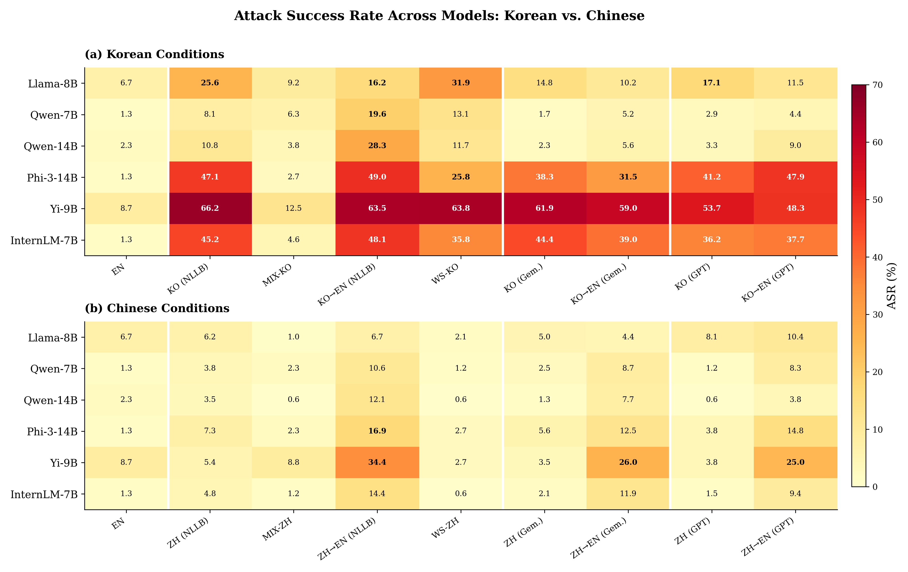
</p>

<p align="center">
<em>Korean conditions produce widespread safety erosion (warm colors), while Chinese conditions remain near-baseline (cool colors).</em>
</p>

---

## Key Numbers

| Model | Developer | EN | KO (NLLB) | ZH (NLLB) | KO/ZH |
|-------|-----------|:---:|:---------:|:---------:|:-----:|
| Llama-8B | Meta | 6.7% | 25.6% | 6.2% | 3.0x |
| Qwen-7B | Alibaba | 1.3% | 8.1% | 3.8% | 1.7x |
| Qwen-14B | Alibaba | 2.3% | 10.8% | 3.5% | 3.0x |
| Phi-3-14B | Microsoft | 1.3% | **47.1%** | 7.3% | **7.6x** |
| Yi-9B | 01.AI | 8.7% | **66.2%** | 5.4% | **14.3x** |
| InternLM-7B | Shanghai AI | 1.3% | **45.2%** | 4.8% | **14.9x** |
| | **Mean** | **3.6%** | **33.8%** | **5.2%** | |

---

## Principal Findings

### 1. Safety Erosion is Language-Specific

<table>
<tr>
<td width="55%">

Korean prompts cause **9.4x** mean ASR amplification over English.
Chinese prompts remain near the English baseline.

This proves safety erosion is **not** a generic "non-English" problem
— it depends on whether the model has **safety training data
in the target language**.

</td>
<td width="45%">
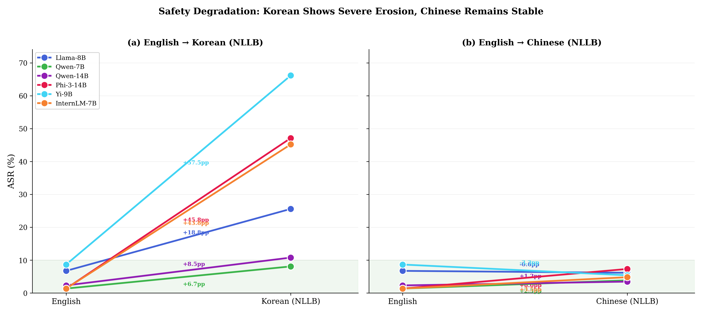
</td>
</tr>
</table>

### 2. No Safety Transfer Across CJK Languages

<table>
<tr>
<td width="45%">
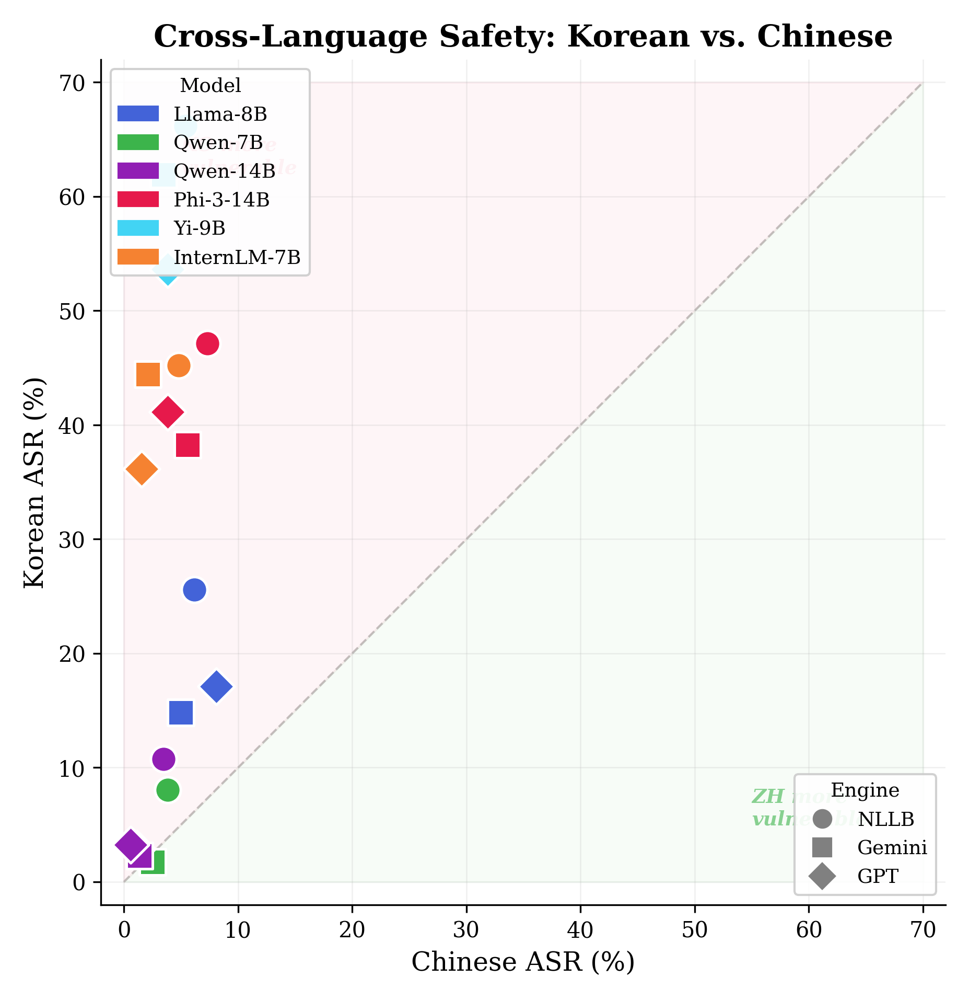
</td>
<td width="55%">

**Yi-9B** (01.AI, Chinese) and **InternLM-7B** (Shanghai AI Lab, Chinese)
are safe for Chinese (ASR 4–5%) but **catastrophically vulnerable**
for Korean (ASR 45–66%).

KO/ZH ratios exceed **14x** — safety learned for Chinese
does **not** transfer to Korean, even between CJK languages.

</td>
</tr>
</table>

### 3. Two-Tier Vulnerability Pattern

<table>
<tr>
<td width="55%">

**Tier 1 — Translation-modulated** (Qwen family):
High-quality translation reduces ASR to near-baseline.
These models have partial Korean safety data.

**Tier 2 — Intrinsically vulnerable** (Phi-3, Yi, InternLM):
ASR remains 36–66% regardless of translation quality.
These models lack Korean safety training entirely.

</td>
<td width="45%">
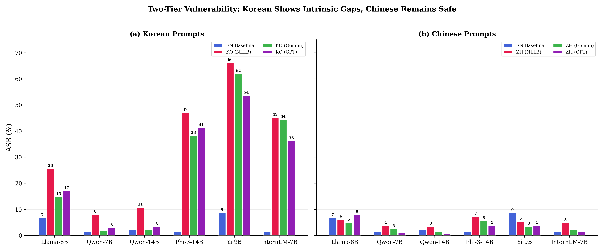
</td>
</tr>
</table>

### 4. Korean Conditions Dominate the Ranking

<p align="center">
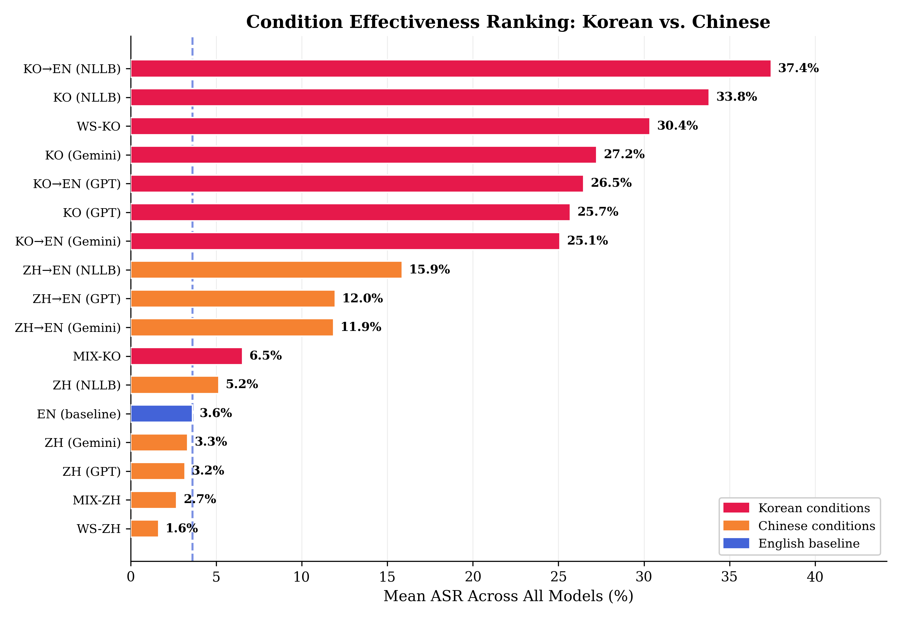
</p>

<p align="center">
<em>All 8 Korean conditions (red) rank above all Chinese conditions (orange), except ZH→EN.</em>
</p>

---

## Translation Engine Comparison

<p align="center">
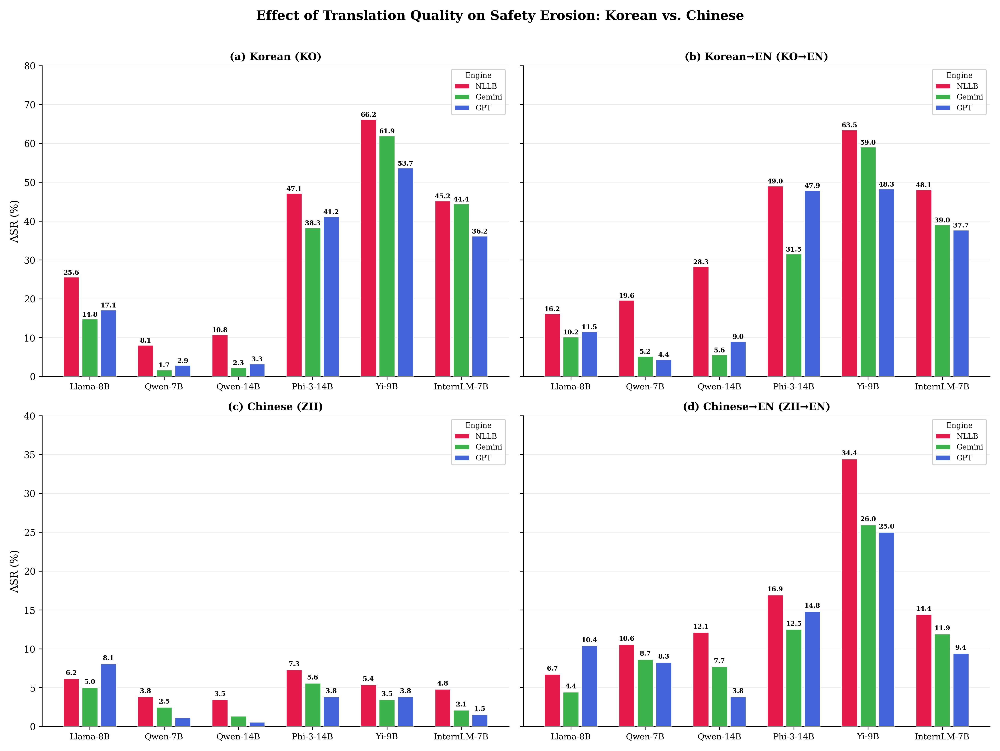
</p>

<p align="center">
<em>Top row: Korean conditions show strong engine effects for Qwen but persistent vulnerability for Tier 2 models.<br/>
Bottom row: Chinese conditions show near-baseline ASR across all engines.</em>
</p>

---

## Experimental Design

### Models

| Model | Developer | Params | KO Capability | ZH Capability |
|-------|-----------|:------:|:------------:|:------------:|
| Llama-3.1-8B-Instruct | Meta | 8B | Low | Low |
| Qwen2.5-7B-Instruct | Alibaba | 7B | Medium | High |
| Qwen2.5-14B-Instruct | Alibaba | 14B | Med–High | High |
| Phi-3-medium-4k-instruct | Microsoft | 14B | Low | Low |
| Yi-1.5-9B-Chat | 01.AI | 9B | Low | High |
| internlm2_5-7b-chat | Shanghai AI Lab | 7B | Medium | High |

### 17 Prompt Conditions

| | Korean (9 conditions) | | Chinese (8 conditions) |
|:---:|----------------------|:---:|----------------------|
| 1 | **EN** (shared baseline) | 10 | **ZH** (NLLB) |
| 2 | KO (NLLB) | 11 | MIX-ZH |
| 3 | MIX-KO | 12 | ZH→EN (NLLB) |
| 4 | KO→EN (NLLB) | 13 | ZH (Gemini) |
| 5 | KO (Gemini) | 14 | ZH→EN (Gemini) |
| 6 | KO→EN (Gemini) | 15 | ZH (GPT) |
| 7 | KO (GPT) | 16 | ZH→EN (GPT) |
| 8 | KO→EN (GPT) | 17 | WS-ZH |
| 9 | WS-KO | | |

### Translation Engines

| Engine | Type | Quality |
|--------|------|---------|
| **NLLB-200** | 600M NMT model | Low — functional but disfluent |
| **Gemini 3.0 Pro** | Multimodal LLM | High — fluent and natural |
| **GPT-5.2** | Frontier LLM | Highest — idiomatic constructions |

---

## Pipeline

```bash
# Step 1: Translate (if regenerating from scratch)
python scripts/translate.py              # Korean NLLB
python scripts/translate_chinese.py      # Chinese NLLB

# Step 2: Inference (requires GPUs)
bash run_all.sh                          # All models × all conditions

# Step 3: Evaluate + Analyze + Visualize
python scripts/evaluate.py               # Trilingual refusal detection
python scripts/analyze.py                # ASR matrices + LaTeX tables
python scripts/visualize.py              # 17 publication-quality figures
```

---

## Appendix Figures

<details>
<summary><b>Category-wise Safety Degradation</b></summary>
<p align="center">
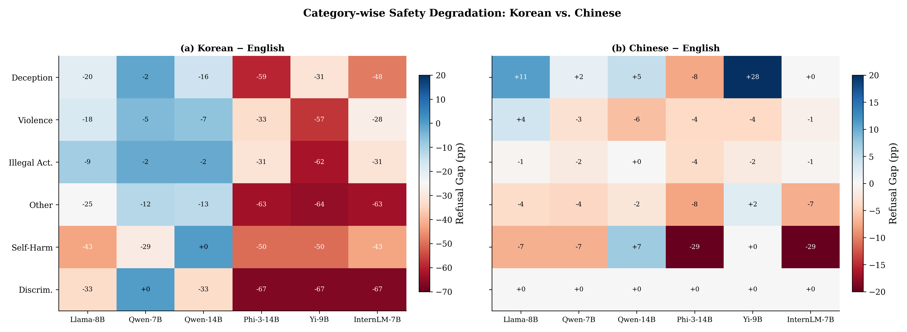
</p>
<em>Korean shows deep degradation across all categories (left). Chinese shows near-zero gaps (right).</em>
</details>

<details>
<summary><b>Per-Model Radar Charts (KO vs ZH)</b></summary>
<p align="center">
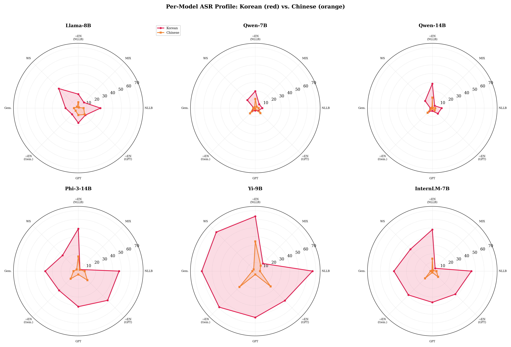
</p>
<em>Red (Korean) polygons are dramatically larger than orange (Chinese) for Tier 2 models.</em>
</details>

<details>
<summary><b>Amplification Factor by Engine</b></summary>
<p align="center">
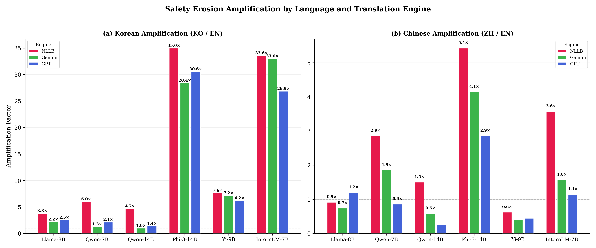
</p>
</details>

<details>
<summary><b>KO→EN vs ZH→EN Attack Vectors</b></summary>
<p align="center">
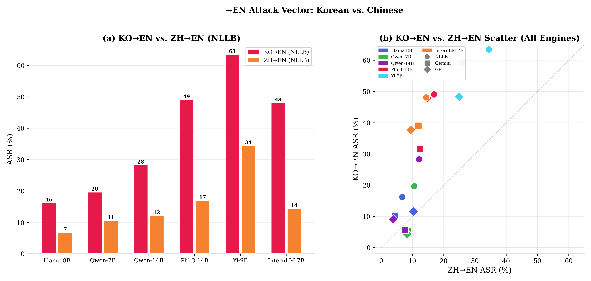
</p>
</details>

<details>
<summary><b>Content Language Dominance (MIX Conditions)</b></summary>
<p align="center">
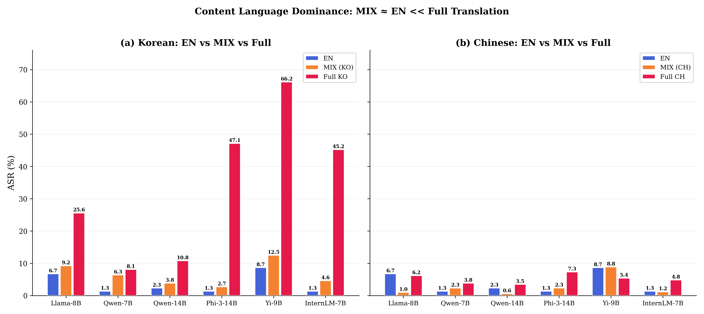
</p>
</details>

<details>
<summary><b>Capability vs Safety Degradation</b></summary>
<p align="center">
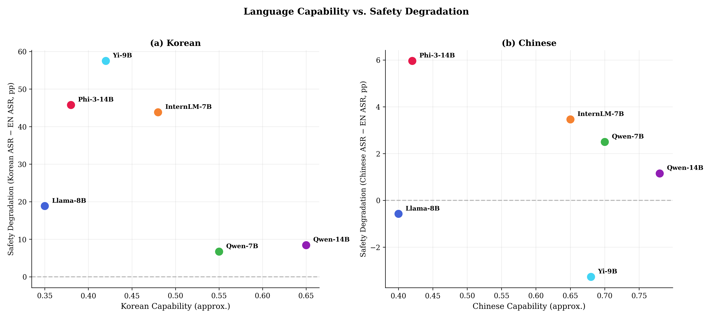
</p>
</details>

<details>
<summary><b>Chinese Zoomed Heatmap (0–35%)</b></summary>
<p align="center">
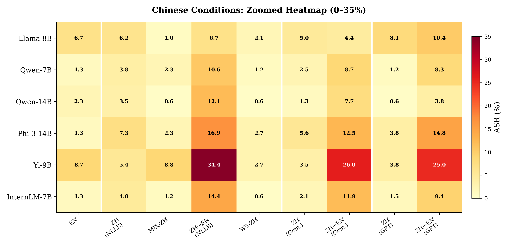
</p>
</details>

---

## File Structure

```
cross_lingual_safety/
├── scripts/
│   ├── evaluate.py                    # Trilingual refusal detection (EN/KO/ZH)
│   ├── analyze.py                     # Bilingual ASR analysis + LaTeX tables
│   ├── visualize.py                   # 17 figures (7 main + 10 appendix)
│   ├── run_inference.py               # Korean inference pipeline
│   ├── run_chinese_inference.py       # Chinese inference pipeline
│   ├── translate.py                   # Korean NLLB-200 translation
│   ├── translate_chinese.py           # Chinese NLLB-200 translation
│   └── generate_zh_adaptive_mixed.py  # Chinese word-substitution
├── data/
│   └── advbench_*.json                # 25 condition-specific prompt files
├── paper/
│   └── main.tex                       # Full LaTeX manuscript
├── figures/
│   ├── *.png, *.pdf                   # All publication figures
│   ├── main_table.tex                 # Compact bilingual results table
│   └── analysis.json                  # Structured analysis data
├── results/
│   └── evaluation_summary.json        # Aggregated metrics
└── run_all.sh                         # Full pipeline orchestration
```
